<div align="center">

# 📦 ProjectHub

### A premium, self-hosted project-management platform — built to run anywhere, even a Raspberry Pi.

Plan projects, run a Kanban board, track bugs, write markdown notes, and watch your
productivity in analytics — in a calm, fast, light/dark interface inspired by
**Linear**, **Notion** and **GitHub Projects**.

<br/>

[](https://github.com/VIK-DD/ProjectHub/releases/latest)
[](LICENSE)
[](https://nextjs.org/)
[](https://www.typescriptlang.org/)
[](https://tailwindcss.com/)
[](https://www.prisma.io/)
[](https://www.sqlite.org/)

[](#-install-as-an-app-pwa)
[](#-telegram-bot)
[](#-running-on-a-raspberry-pi)
[](#-languages--internationalization)
[](#-running-on-a-raspberry-pi)
[](#-contributing)

[](https://github.com/VIK-DD/ProjectHub/stargazers)
[](https://github.com/VIK-DD/ProjectHub/issues)
[](https://github.com/VIK-DD/ProjectHub/commits)

<br/>

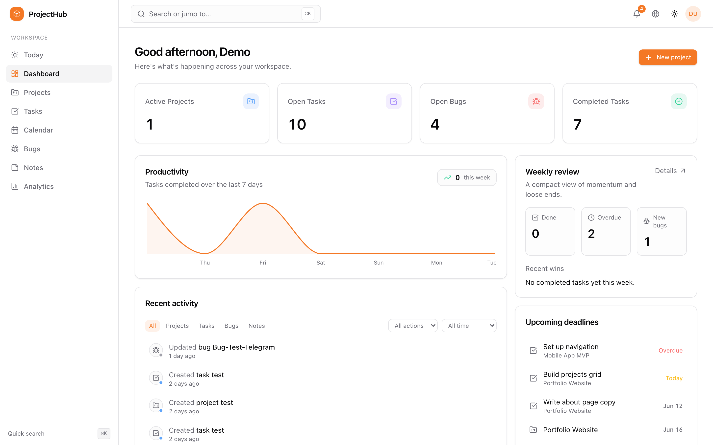

</div>

---

> [!NOTE]
> **Language.** ProjectHub's interface and codebase are written in **English**. A
> complete **Romanian (🇷🇴) translation is bundled** and can be switched instantly
> from the top bar — no reload, no rebuild. See [Languages & i18n](#-languages--internationalization).

## 📑 Table of contents

- [Features](#-features)
- [Screenshots](#-screenshots)
- [Tech stack](#-tech-stack)
- [Quick start (local)](#-quick-start-local)
- [Running on a Raspberry Pi](#-running-on-a-raspberry-pi)
- [Telegram bot](#-telegram-bot)
- [Languages & internationalization](#-languages--internationalization)
- [Install as an app (PWA)](#-install-as-an-app-pwa)
- [Health, monitoring & backups](#-health-monitoring--backups)
- [Scripts](#-scripts)
- [Keyboard shortcuts](#-keyboard-shortcuts)
- [Project structure](#-project-structure)
- [Switching to PostgreSQL](#-switching-to-postgresql)
- [Roadmap](#-roadmap)
- [Contributing](#-contributing)
- [License](#-license)

---

## ✨ Features

#### 🗂️ Plan & organize
- **Dashboard** — active projects, open tasks/bugs, completed work, productivity chart, weekly review, recent activity feed (with filters) and upcoming deadlines.
- **Projects** — statuses, priorities, progress %, tags (with filtering), **milestones**, start/due dates, **saved views** and an elegant **Active / Archived** split.
- **Tasks** — **Kanban board with drag-to-reorder** + list view, subtasks, **recurring tasks**, **time tracking**, **bulk actions**, search & filters, saved views.
- **Calendar** — month view of tasks and project deadlines; click a day to add, drag to reschedule.
- **Bugs** — severity & status workflow, link to projects, reproduction steps and fix notes.
- **Notes** — markdown editor with live preview, **interactive checkboxes**, pinning, project-scoped or personal, saved views.

#### 📊 Understand
- **Analytics** — completion rate, weekly throughput, 14-day activity, status distributions, open vs. resolved bugs.
- **Weekly review** — a dedicated tab summarizing momentum, what shipped, what slipped and loose ends.
- **Activity log** — a filterable, chronological record of everything across the workspace.

#### ⚡ Move fast
- **⌘K command palette** — global search, navigate anywhere, create a task in any project, toggle theme.
- **Undo everywhere** — deletes surface a centralized *"… deleted — Undo"* toast.
- **Reminders & notifications**, elegant empty states, fully **responsive / mobile-friendly**, **light & dark** themes.

#### 🔐 Own your data
- **Self-hosted**, single-file SQLite database, **JSON export/import** from Settings.
- **Account** — profile, password change, theme, language.
- **Installable PWA** + **Telegram companion bot** + **health endpoint** for uptime monitoring.

---

## 📸 Screenshots

<div align="center">

| Kanban board | Analytics |
| :---: | :---: |
| 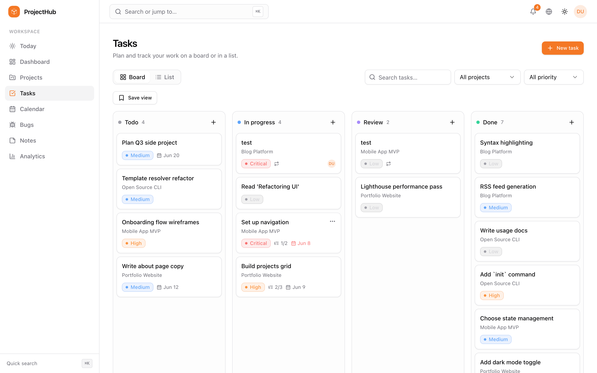 | 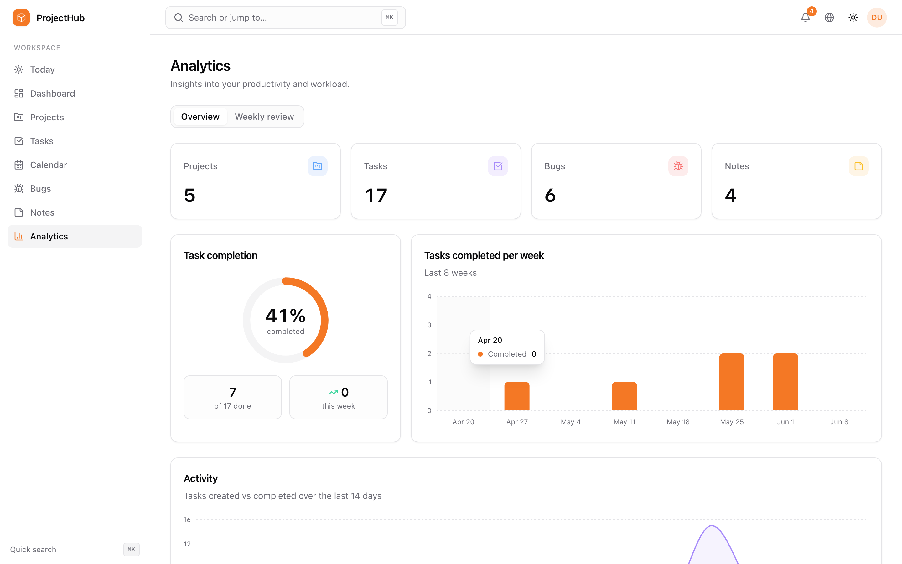 |
| **Projects** | **Notes** |
| 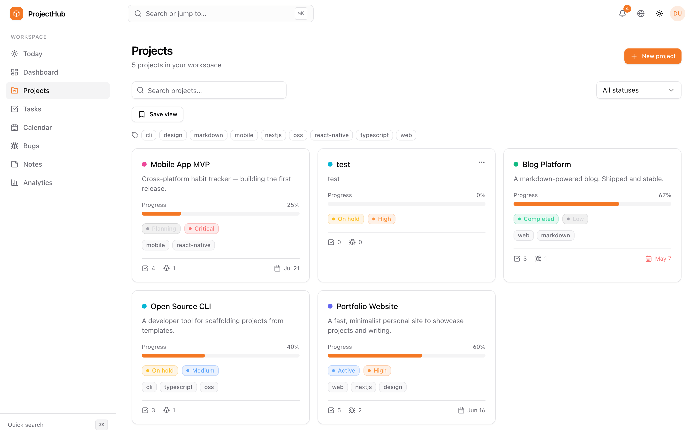 | 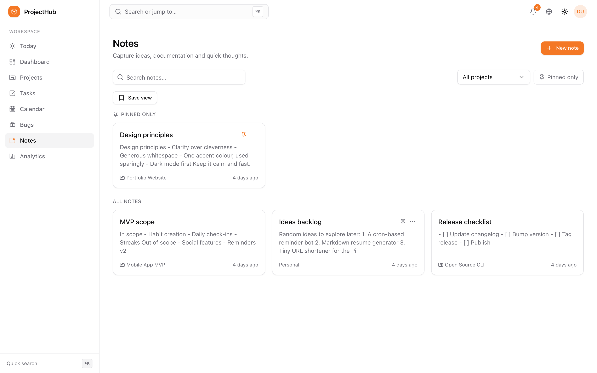 |
| **Command palette (⌘K)** | **Sign in** |
| 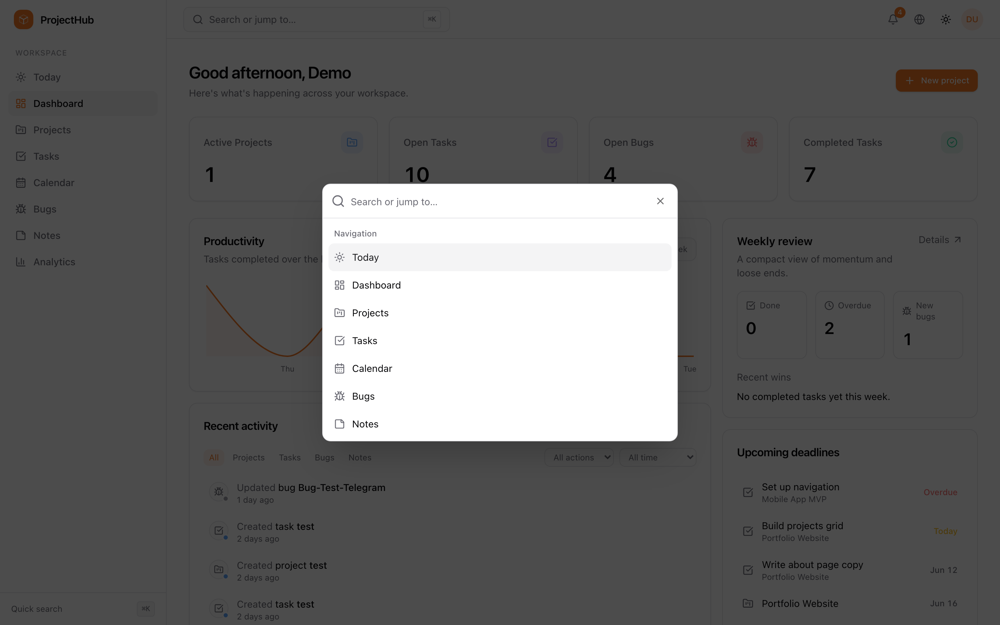 | 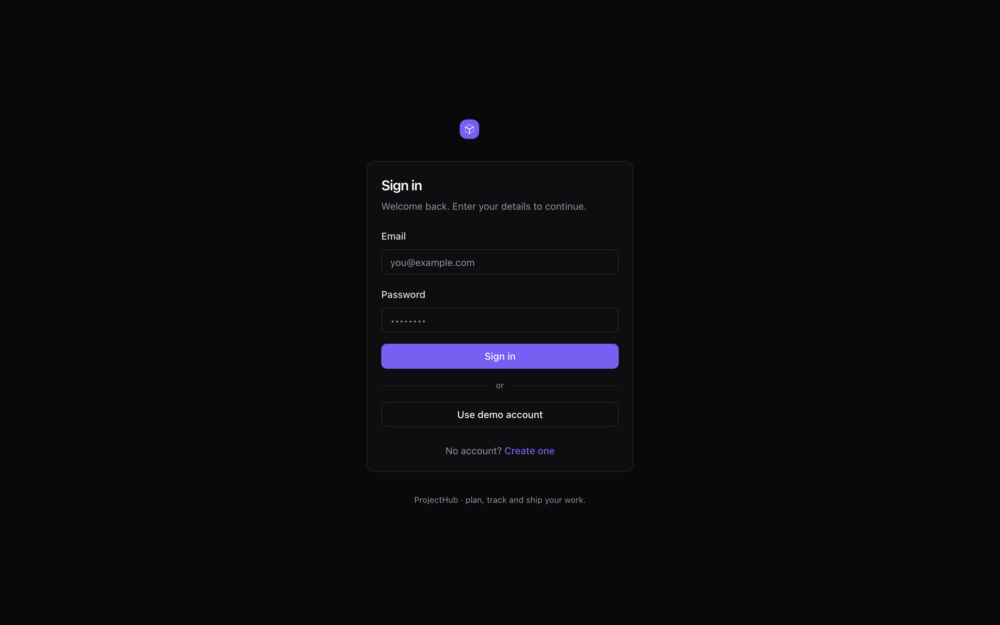 |

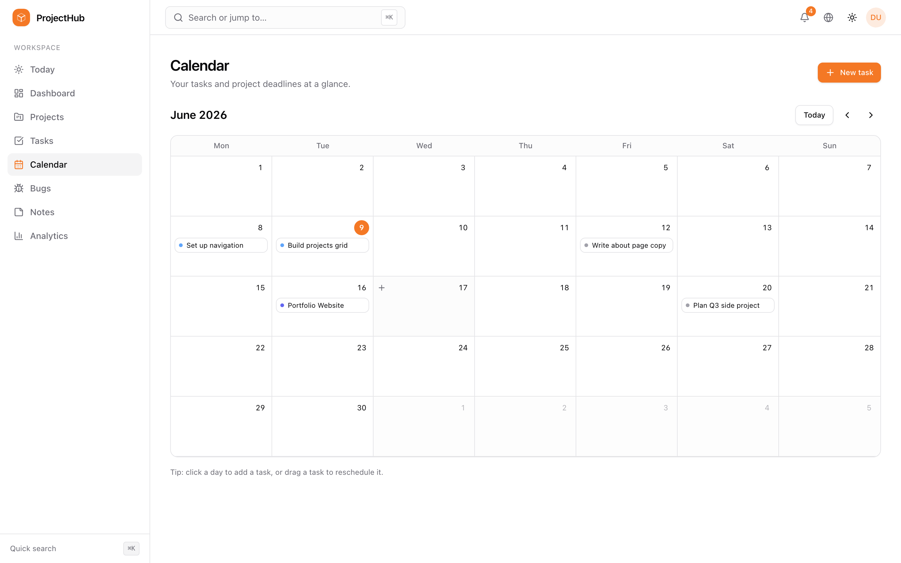

#### 📱 Mobile

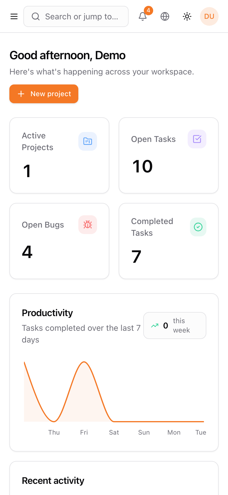 &nbsp;&nbsp; 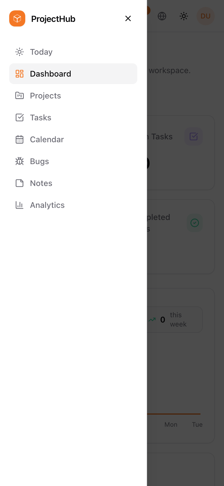

</div>

---

## 🧱 Tech stack

| Layer      | Choice                                              |
| ---------- | --------------------------------------------------- |
| Framework  | Next.js 14 (App Router) · React 18 · TypeScript 5   |
| Styling    | Tailwind CSS · shadcn-style UI · Radix primitives   |
| Data       | Prisma ORM · **SQLite** (swappable to PostgreSQL)   |
| Auth       | NextAuth (credentials, JWT sessions)                |
| Mutations  | Server Actions                                      |
| Charts     | Recharts                                            |
| Companion  | Telegram bot (zero-dependency, long-polling ESM)    |
| i18n       | Cookie-based dictionaries — English & Romanian      |

#### Why SQLite by default?

The goal was *simple to run on a Raspberry Pi*. PostgreSQL means a separate
database server to install, configure and keep alive. **SQLite is a single file** —
zero configuration, tiny memory footprint, rock-solid on ARM. Because everything
goes through Prisma, switching to Postgres later is a [two-line change](#-switching-to-postgresql).

---

## 🚀 Quick start (local)

Requires **Node.js 18.18+** (Node 20 LTS recommended).

```bash
# 1. Clone
git clone https://github.com/VIK-DD/ProjectHub.git
cd ProjectHub

# 2. Install dependencies
npm install

# 3. Create the SQLite database + demo data (one command)
npm run setup        # prisma generate + db push + seed

# 4. Run the dev server
npm run dev
```

Open <http://localhost:3000> and sign in with the demo account:

```
Email:    demo@projecthub.local
Password: demo1234
```

> [!IMPORTANT]
> Before exposing ProjectHub publicly, set a real `NEXTAUTH_SECRET` in `.env`
> (`openssl rand -base64 32`).

---

## 🍓 Running on a Raspberry Pi

Tested on a Pi 4 / Pi 5 running 64-bit Raspberry Pi OS.

<details>
<summary><b>1. Install Node.js 20 LTS</b></summary>

```bash
curl -fsSL https://deb.nodesource.com/setup_20.x | sudo -E bash -
sudo apt-get install -y nodejs
```
</details>

<details>
<summary><b>2. Get the app onto the Pi & install</b></summary>

```bash
cd projecthub
npm install
```
</details>

<details>
<summary><b>3. Configure environment</b></summary>

Edit `.env`, set a strong secret, and point `NEXTAUTH_URL` at how you'll reach the app:

```env
NEXTAUTH_SECRET="<paste output of: openssl rand -base64 32>"
NEXTAUTH_URL="http://192.168.1.50:3000"   # or your Tailscale / domain URL
```
</details>

<details>
<summary><b>4. Initialise the database & build</b></summary>

```bash
npm run setup     # creates prisma/dev.db and seeds it
npm run build
```

> **Low-memory Pi (512 MB – 1 GB)?** The Next.js build can be memory-hungry. Give Node
> more headroom and/or add swap:
>
> ```bash
> NODE_OPTIONS=--max-old-space-size=1024 npm run build
> ```
</details>

<details>
<summary><b>5. Run it & keep it alive (PM2)</b></summary>

```bash
sudo npm install -g pm2
pm2 start npm --name projecthub -- start
pm2 save
pm2 startup        # follow the printed instructions to start on boot
```

Browse to `http://<pi-ip>:3000` from any device on your network.
</details>

> 💡 **Tip from the trenches:** when redeploying, only delete the old `.next`
> *after* the new build/upload has finished successfully — otherwise a failed
> transfer can leave the Pi with no production build to serve.

---

## 📲 Telegram bot

A premium, **zero-dependency** long-polling bot (no public webhook — perfect behind
Tailscale). Each Telegram chat is linked to one ProjectHub account; unlinked chats can
only `/start`, `/link`, `/help`. Everything else is **inline-keyboard driven**.

**What it does**
- 📊 Dashboard at a glance · 🙋 **My Tasks** (Today / Overdue / This week)
- ✅ Guided task creation (project → title → priority → due → confirm)
- 📁 Browse & create projects · 🐛 Bugs (change **status** & **severity**) · 📝 Notes
- 💬 Comments with **@mentions** (reply or button) · 🔎 Extended search · ◀️ ▶️ pagination
- ☀️ Automatic **morning digest** + 🌙 nightly **JSON backup** to your chat

```bash
# 1. Create a bot with @BotFather, then put the token in .env:
#    TELEGRAM_BOT_TOKEN="123456:ABC..."

# 2. Run it under PM2
pm2 start bot/bot.mjs --name projecthub-bot && pm2 save
```

Then, in ProjectHub: **Settings → Telegram → Connect Telegram** to get a code, and send
it to the bot: `/link ABC123`. Done — the bot now acts as you.

<div align="center">
  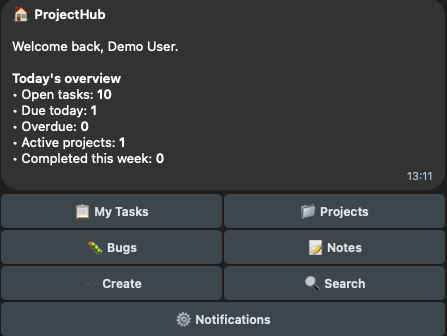
</div>

---

## 🌍 Languages & internationalization

ProjectHub ships fully translated in **English** and **Romanian (🇷🇴)**.

- The source language is **English** — code, comments and the primary dictionary.
- Switch language anytime from the **globe icon in the top bar**; the choice is stored
  in a cookie (no reload needed).
- Translations live in [`lib/i18n/dictionaries.ts`](lib/i18n/dictionaries.ts); the default
  locale is set in [`lib/i18n/config.ts`](lib/i18n/config.ts). Adding a language is just
  another dictionary entry.

---

## 📱 Install as an app (PWA)

ProjectHub ships a web manifest, generated icons and a service worker, so you can
**Add to Home Screen** on a phone or tablet and launch it full-screen. (Android Chrome
needs HTTPS for full install; iOS Safari works over your LAN.)

---

## 🩺 Health, monitoring & backups

- `GET /api/health` → JSON `{ status, db, uptime }` (200 healthy, 503 when the DB is down) — point an uptime monitor at it.
- `/status` → a simple human-readable status page.
- **Backups** — the whole database is one file (`prisma/dev.db`). `scripts/backup-db.sh` makes a safe online copy and prunes old ones:

  ```bash
  chmod +x scripts/backup-db.sh
  crontab -e
  # daily at 3am, keep the newest 14:
  0 3 * * *  /home/pi/projecthub/scripts/backup-db.sh >> /home/pi/projecthub/backups/backup.log 2>&1
  ```

  You can also export/import a portable JSON backup from **Settings → Data & backup**.

---

## 📜 Scripts

| Script              | Description                                        |
| ------------------- | -------------------------------------------------- |
| `npm run dev`       | Start the dev server                               |
| `npm run build`     | Production build (runs `prisma generate` first)    |
| `npm start`         | Start the production server                        |
| `npm run bot`       | Run the Telegram bot                               |
| `npm test`          | Run the unit tests                                 |
| `npm run lint`      | Lint with ESLint (Next.js config)                  |
| `npm run setup`     | generate + push schema + seed (first-time setup)   |
| `npm run db:push`   | Apply the Prisma schema to the database            |
| `npm run db:seed`   | Seed demo data + demo account                      |
| `npm run db:studio` | Open Prisma Studio to browse the database          |
| `npm run db:reset`  | Reset the database and re-seed                     |

---

## ⌨️ Keyboard shortcuts

- **⌘K / Ctrl-K** — open the command palette (search, navigate, create a task in any project, toggle theme).

---

## 🗂️ Project structure

```
app/
  (auth)/                 # login & register
  (app)/                  # authenticated shell (sidebar + topbar)
    dashboard/  today/  projects/[id]/  tasks/[id]/
    bugs/  notes/  calendar/  analytics/  settings/  trash/
  api/                    # auth, health, search, backup, projects, tasks,
                          # comments, attachments, client-errors, icon
  status/                 # human-readable status page
components/
  ui/                     # shadcn-style primitives
  layout/                 # sidebar, topbar, command menu, mobile sidebar
  dashboard/ projects/ tasks/ bugs/ notes/ analytics/ settings/ charts/
lib/
  actions/                # server actions (projects, tasks, bugs, notes, views, auth…)
  i18n/                   # dictionaries (EN/RO), config, server & client helpers
  data.ts                 # dashboard & analytics queries
  auth.ts  session.ts  prisma.ts  rate-limit.ts  markdown.ts
bot/
  bot.mjs                 # the Telegram bot (long-polling)
  pure.mjs                # side-effect-free helpers (shared, unit-tested)
prisma/
  schema.prisma           # 14 models: User, Project, Milestone, Task, Subtask,
                          # Bug, Note, Comment, Attachment, TimeEntry,
                          # ProjectMember, Notification, TelegramLinkToken, ActivityLog
  seed.ts
tests/                    # unit tests (bot helpers, rate-limit)
```

---

## 🔁 Switching to PostgreSQL

1. In `prisma/schema.prisma`, change the datasource provider:

   ```prisma
   datasource db {
     provider = "postgresql"
     url      = env("DATABASE_URL")
   }
   ```

2. In `.env`, set `DATABASE_URL` to your Postgres connection string.
3. Run `npm run db:push` (and `npm run db:seed` for demo data).

Nothing else changes — the app code is database-agnostic.

---

## 🗺️ Roadmap

- [ ] 🤖 **Claude AI assistant** — natural-language task & project actions in-app.
- [ ] 📦 **One-command `deploy.sh`** — build → upload → restart, safely (no half-deploys).
- [ ] More languages (the i18n layer is ready for them).

---

## 🤝 Contributing

Issues and PRs are welcome! For substantial changes, open an issue first to discuss what
you'd like to change. Run `npm run lint` and `npm test` before submitting.

---

## 📄 License

Licensed under the **Apache License 2.0** — see [LICENSE](LICENSE) for details.

Copyright © 2026 VIK-DD.

<div align="center">

Made to be calm, fast, and yours. Enjoy shipping. 🚀

</div>
